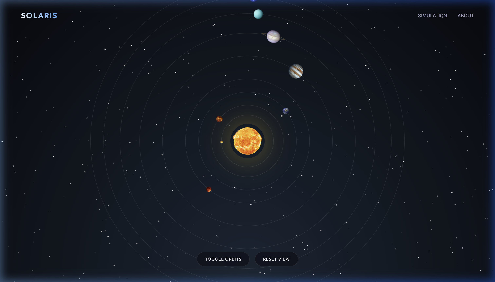
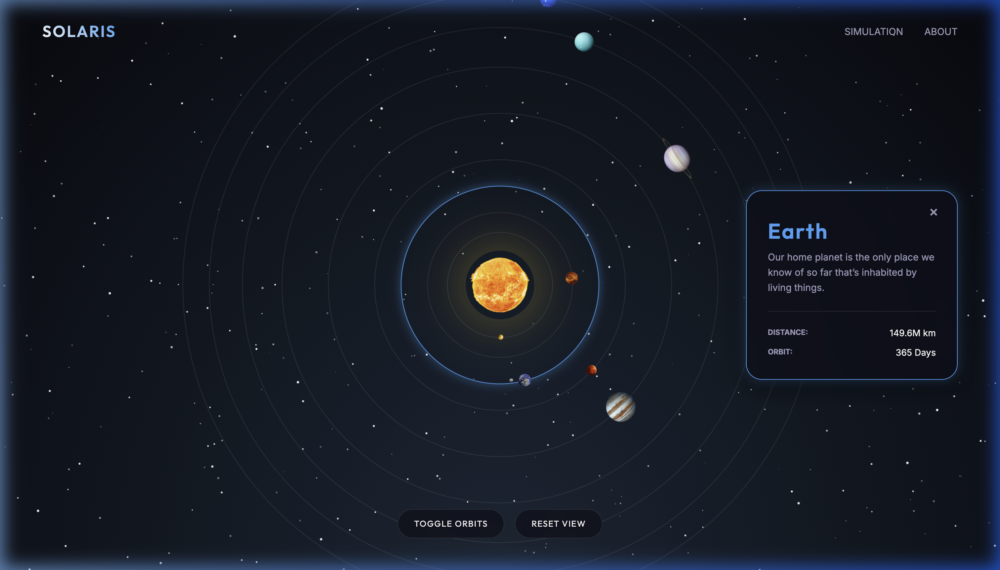
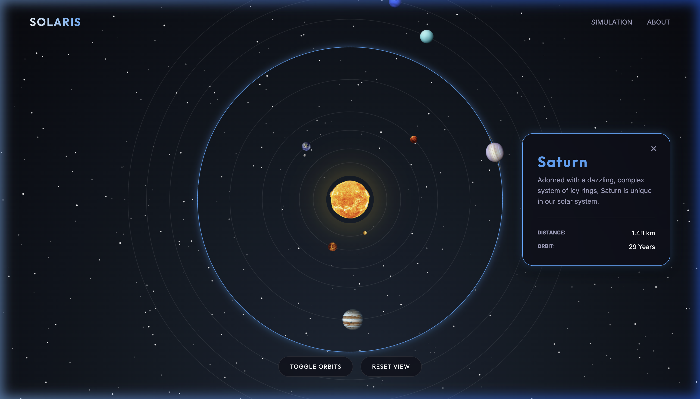

# 🌌 Solaris | Interactive Solar System Simulation

Solaris is a premium, interactive 3D solar system simulation built with **HTML5, CSS3, and JavaScript**. It combines high-performance CSS animations with an elegant glassmorphism UI to provide an immersive and educational experience.



## ✨ Features

- **Realistic Orbital Mechanics**: Each planet follows its relative orbital period using precise GPU-accelerated CSS keyframe animations.
- **Interactive Info Panel**: Click on any planet to reveal a dynamic, glassmorphism-styled information card with a smooth "pop-up" animation from the right.
- **Visual Feedback**: Real-time selection highlights on orbital paths and glowing planet effects.
- **Advanced Controls**: Toggle orbit lines, reset the view, and smooth mouse-wheel zoom functionality.
- **Premium Aesthetics**: Deep space starfield with twinkling effects, smooth gradients, and high-quality planet textures.

## 🛠️ Technical Architecture

Solaris is designed with a "CSS-first" philosophy for animations, ensuring buttery-smooth performance by offloading orbit calculations to the browser's render engine.

### 🎨 CSS Animation Engine
The core orbital movement is handled by the CSS transition engine. By using relative orbital periods (normalized to Earth's 36.5s cycle), we achieve realistic comparative speeds without the overhead of a heavy physics engine.
- **Keyframes**: `orbit` rotation from `0deg` to `360deg`.
- **Transitions**: Complex `cubic-bezier` curves (e.g., `cubic-bezier(0.34, 1.56, 0.64, 1)`) provide "premium" spring-like animations for UI elements.

### ⚙️ JavaScript Interactivity
JavaScript acts as the orchestration layer for all dynamic user interactions:
- **Event Handling**: Efficient click detection for celestial bodies.
- **Dynamic Content Injection**: Extracting planetary metadata from the DOM's `data-*` attributes for real-time UI updates.
- **State Management**: Managing the "Active Selection" state and toggling UI transitions.

### 📐 Layout & Styling
- **Glassmorphism**: Modern UI aesthetic achieved through `backdrop-filter: blur(16px)` and semi-transparent layering.
- **Responsive Design**: Fluid scaling for different screen sizes, ensuring the simulation remains usable on tablets and laptops.

## 📂 Project Structure

```text
Solaris/
├── index.html          # Main entry point and structural layout
├── src/
│   ├── style.css       # Core styling and animation engine
│   └── script.js       # Interaction logic and state management
├── assets/
│   ├── images/         # Planet and UI textures
│   └── previews/       # README screenshots and demonstrations
└── README.md           # Project documentation and architecture
```

## 🚀 Getting Started

1. **Clone the repository**:
   ```bash
   git clone https://github.com/KaavyaGala546/Solar-System-Simulation.git
   ```
2. **Open the simulation**:
   Simply open `index.html` in any modern web browser to start exploring.

## 📸 Media Gallery

````carousel

<!-- slide -->

<!-- slide -->

````

## 👩‍💻 Author

**Kaavya Gala**
[GitHub Profile](https://github.com/KaavyaGala546)
